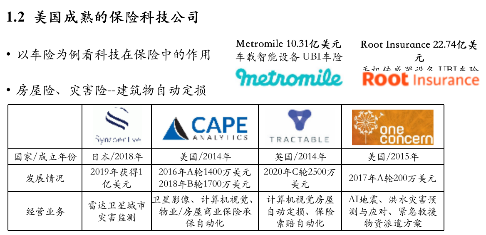

jbh

# 无人机三维重建与遥感迁移学习

#### 在河南特大洪涝灾害中的应用探索

关键词：减灾科技、点云、迁移学习

2021.10.20 司马数慧

汇报人：金泊翰 （手机号）

指导与协助：苏锦华、祁晨瑞

Available at https://github.com/SmartDataLab/DRT-SHARE

Written by Marp and Mermaid in Markdown


---

# 讲稿说明

预计讲稿4000字 
20分钟（会场时限是25分钟，留一定的富裕时间） 
语速控制在每分钟200字 
预计20-30页PPT有实际内容的PPT
请根据我的讲稿文字进行PPT的协助补充

---

```
大家下午好，我是中国人民大学环境学院的金泊翰，
研究方向是遥感与无人机，现担任人大无人机社社长。
首先非常荣幸受邀参加R会与大家做这次分享，
我将就无人机三维重建和遥感的迁移学习的技术以及实际探索进行分享，
分享案例重点围绕河南特大洪涝灾害，
分享涉及的部分技术和结果受司马数慧的苏锦华和祁晨瑞师兄指导，
无人机数据为无人机社飞手采集，无人机设备由司马数慧提供支持，
欢迎对该无人机数据感兴趣的联系我们，我们提供无人机影像采集的服务。
同时也欢迎参会的人大学生加入人大无人机社团和司马数慧保险科技创新工坊。
```

---

<!-- https://emojipedia.org/twitter/ just coppy -->
<!-- https://emojipedia.org/shortcodes/ -->
<!-- https://alanhou.org/wechat-emoji/ -->
# 汇报内容

- :flushed: 背景与需求
- :thinking: 现有技术与研究
    + :upside_down_face: 遥感自动定损
    + :hugs: 无人机三维重建
- :frowning: 案例与目标
- :grimacing: 图像分割结果
- :yum: 损失分析结果
- :star_struck: 遥感迁移学习方案
- :smirk_cat: 讨论

---


```
我的分享内容主要如下：
首先从救灾以及保险角度介绍无人机和遥感技术的应用潜力和需求，
其次是遥感自动定损与无人机三维重建技术的原理和效果，
随后介绍的是河南洪水这个实际案例的背景以及我们希望应用上述技术实现的具体目标,
主要结果我们分为三个板块呈现:
一是对建筑物、路网和灾害源的图像分割结果；
二是对受灾区域、面积、体积，受灾前后顺序进行损失分析；
三是结合遥感以及无人机实现灾害自动化评估的流程方案；
最后板块是对技术的展望以及行业现状的讨论。
```

---
# 背景与需求

台风、暴雨、洪水、山体滑坡等重大灾害发生后，保险公司需要第一时间了解企业、建筑及工程等受灾标的灾前和灾后情况，精确、快速的评估标的损失，以迅速开展施救和定损工作，减少客户损失，助力灾后恢复重建。


<!--  -->

<!--  -->

<!--  -->




---


```
我们先从行业背景引入这个分享的话题，
我们对系统性风险的防护其实是很不足的，
大型灾害给个体带来的风险缺乏有效的风险管理方案，
在国外，洪水险、房屋险等相关的灾害保险已经成熟，
但国内保险业在灾害保险的发展上相对滞后，
庆幸的是，中国的救灾与防控能力在世界上首屈一指，
并且如中国再保险集团、中国地震局、国家减灾中心等机构
积极应用遥感技术监控灾害风险，推出地震模型服务于保险产品
总体上监控受灾情况，自动评测受灾等级对实时救援、保险理赔有重要意义
应用遥感技术的保险技术中，农业保险发展较早，并且较为成熟,
因为农业的各项数据数据足够丰富且高频，无论是产量，
还是说卫星数据源有针对主流作物的特定谱段的图像传感器，
总而言之，言而总之，遥感对于高频监控的农业保险是有优势的，
同理国外洪水保险发展的较早，洪水台风作为一种高频的自然灾害，
也客观使得洪水保险模型收敛所需的数据较少，
所以国外是已经涌现了一批与灾害保险相关的所谓的保险科技公司，
比如应用遥感技术对房屋进行全自动的承保、定损、理赔、续保流程，
但反观国内，房屋险虽然是有，但不承保川蜀等地震高发区，
洪涝损失虽然是保，但保司会要求个人向气象局申请重大气象灾害证明，
而气象局通常不对个人出示证明，所以很多时候对于灾害理赔的道路是坎坷的，
对于保司来说，管控定损的成本以及保证资产安全的精算定价都是信息匮乏且压力巨大的。
遥感与无人机技术听起来有潜力在监控和定损上提供更多信息，它是不是出路不好说，但是现有房屋险产品的改进是市场需要的。
因为目前的房屋险其实主要保障的就是火灾、失窃等人为因素造成的损失，无法真正保障灾害造成的损失。
```


---
# 现有技术与研究

##### 遥感自动定损

确定是只有房屋信息 而且其实高程信息难以获得，一般只能获得屋顶损毁和重度损坏。优点是序列数据，全球观测，可以持续观测灾害主体，比如山火、洪水。
##### 无人机三维重建

无人机遥感等观测技术和人工智能的长足发展，为快速精准评估企业、建筑及工程损坏情况、滑坡塌方土方量等提供了可能。
优点是更精细、专注小区域，可以得到斜拍信息。


---

```
那么遥感和无人机技术究竟怎样应用在监控与自动定损，以及两者的适用条件和优缺点在何处，
我们先来了解一下技术的原理和当前技术的上边界在哪里。
遥感自动定损技术技术使用灾后影像作为输入，在数据允许的条件下，使用灾前遥感图像作为辅助，
识别建筑物区域以及不同建筑物的物理受损等级，只用灾后图像通常难度会比较大，
对于灾损严重的区域，甚至无法识别出正确的建筑物面积，
同时使用灾前灾后图像可以认为是变化检测问题，
这样做的好处是，灾前建筑物轮廓清晰，使得建筑物区域可以被有效分割，
甚至说正常卫星影像下建筑物区域的识别已经是成熟任务，IoU可以达到90%以上。
同时灾前灾后的图像通过对比可以更准确的判定单次灾害造成的变化，
防范既有损失的房屋骗保，减少逆向选择的问题。
但遥感影像最大的问题在于更新频率有限制，一般卫星需要15天左右才会途径相同区域进行拍摄，
对于实时救援来说，尤其是救援分秒必争的地震、山火、泥石流等巨型灾害，灾害发生越快越自动化的评测是最有必要的，
对于洪水、台风等持续性但灾后相对容易恢复的季节性自然灾害，需要短期集中的持续性的观测，
另一方面，遥感影像分辨率受限，因为国家安全以及技术原因，亚米级分辨率遥感数据难以获取，
同时拍摄角度为垂直拍摄，对于阴影有限的小型建筑物的高程信息估计不是很准确，
更不要说获取实时救援中最希望获取到受困群众的信息了，这时候无人机的优势恰好能弥补上述缺点，
无人机高分辨率的拍摄同时能根据指定轨迹进行拍摄，比如Z型的扫描，使得多次拍摄的照片能够拼接成一张大图。
三维重构的原理也是如此，因为同一个建筑物在无人机的多次拍摄下存在角度差异，
这样的差异通过匹配可以刻画建筑物的高度以及三维信息，
这个刻画的过程会生成一种数据叫点云，如图所示，
点云源于多次拍摄中匹配的像素点，这些像素点结合无人机的GPS定位能够确定绝对的空间位置信息，
所以通过进一步处理能够得到三维模型，高程信息、材质信息都可以通过点云得到很好的描述，
这一技术已被广泛应用在测绘领域，对房屋的估价也有很大的帮助
```

---

# 自动定损技术


---

```
其中具体的模型和原理我们简要介绍一下，但不是本次分享的重点
（xView2 使用的CNN模型）
（ArcGis使用的相应的方法与方案）
```

---


# 无人机三维重建技术


---

# 目标

结合两者得到更好灾害损坏评估。

---

# 实际案例（河南洪水）

卫星数据
- google earth 遥感

---

# 无人机采集

- 8月1日-3日 河南鹤壁 大疆Pro和RTX 路径斜拍(合成正投影和点云)


---
# 数据处理

- 遥感数据灾前灾后

- 无人机
    - 正投影
    - 点云->建筑物分割

---
# 数据处理cont.

---

# 具体目标

研究内容：基于无人机、遥感卫星的多源多模态大数据和深度迁移学习技术，实现对灾情现场的快速3D重建，实现灾前灾后对应位置的标注和对比，利用深度卷机网络实现对现场房屋、道路等的实时识别，实现受损标的长度、面积、土方体积等的快速测量和评估。选取典型灾害场景、选取典型区域开展试点研究，验证方法的适用性和准确性，探索保险应用模式。

---

**1.语义分割**
(遥感或无人机正投影图)

- :smile: 建筑物分割
- :smile: 路网分割
- :smile: 水域分割


---

**2.三维重建与灾情模拟与推演**
(无人机)

- :smile: 淹没面积
- :smile: 淹没先后(模拟实验)
- :cry: 实际浸没体积

---

**3.深度学习模型的自适应迁移**

- :cry: 自动化伪标签
- :cry: 迁移学习方案

而传统深度学习人工智能模型依赖大量标注数据，但实际灾情多样复杂，标注数据稀缺，需要研究建立面向灾前（遥感）灾后（遥感、无人机）图像的自适应迁移学习算法，以真正将无人机遥感影像、地理信息和人工智能技术有效融合。

---

# 1.1 语义分割-建筑物语义分割

---

# 1.2 语义分割-路网语义分割

---

# 1.3 语义分割-水域分割(危险灾源)

---

# 2.1 淹没面积

---


# 2.2 淹没推演(模拟实验)


---


# 2.3 实际浸没面积


---
# 3.1 自动化伪标签


为什么叫伪标签，为什么不需要很准，其实成本考虑

---


# 3.2 深度迁移