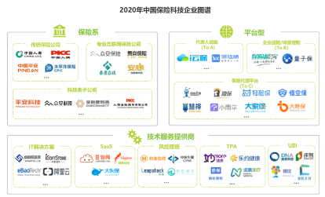
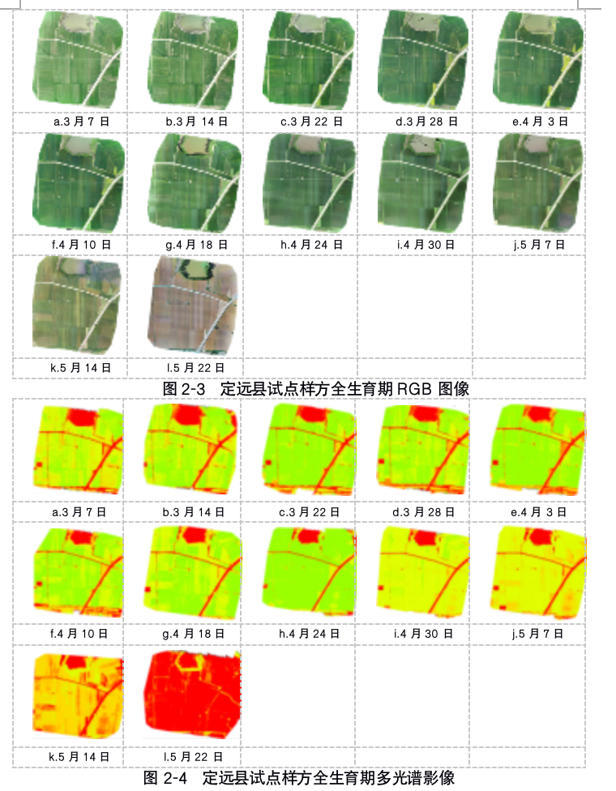
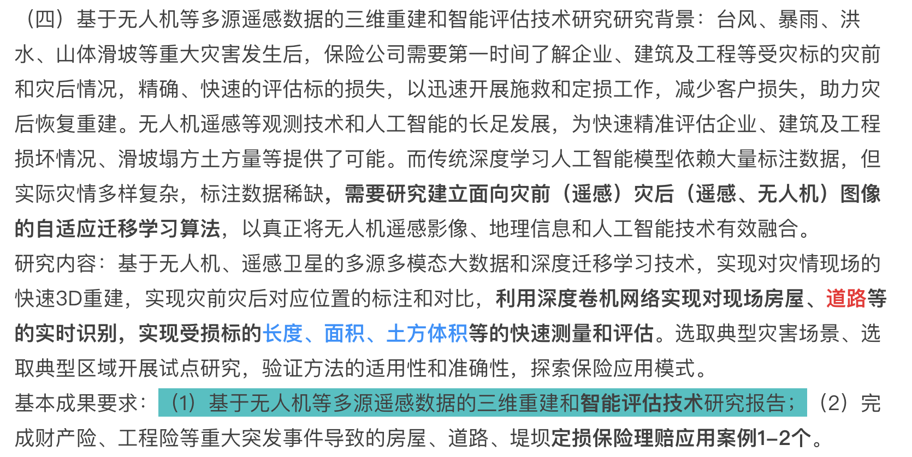

# 无人机三维重建与遥感迁移学习

关键词：减灾科技、点云、迁移学习

2021.10.20 司马数慧

汇报人：金泊翰

指导与协助：苏锦华、祁晨瑞

Available at https://github.com/SmartDataLab/DRT-SHARE

Written by Marp and Mermaid in Markdown

---

# 巨灾保险现有问题

- 政府购买、没有面向个人的产品
- 赔付与具体个人受损解耦
- 定损、救援减灾、重建息息相关

<!--  -->

---

# 自动定损技术

---

# 自动定损技术 cont.

---

# 当前主要的问题

- 灾前灾后遥感不够实时
- 以屋顶损失代替了建筑物损失
- 物理损失不代表经济损失(asset exposure)

$DLI=\sum w_i \times f_i$

---

# 现有的数据

- google earth 遥感
- 8月1日-3日 河南鹤壁 大疆Pro和RTX 路径斜拍(合成正投影和点云)

---

# 研究目标

PICC&减灾防控中心课题项目

---

# 参考方案

Transfer Component Analysis

---

# 背景

台风、暴雨、洪水、山体滑坡等重大灾害发生后，保险公司需要第一时间了解企业、建筑及工程等受灾标的灾前和灾后情况，精确、快速的评估标的损失，以迅速开展施救和定损工作，减少客户损失，助力灾后恢复重建。

---
# 现有技术与研究

## 遥感自动定损

确定是只有房屋信息 而且其实高程信息难以获得，一般只能获得屋顶损毁和重度损坏。优点是序列数据，全球观测，可以持续观测灾害主体，比如山火、洪水。
## 无人机三维重建

无人机遥感等观测技术和人工智能的长足发展，为快速精准评估企业、建筑及工程损坏情况、滑坡塌方土方量等提供了可能。

优点是更精细、专注小区域，可以得到斜拍信息。

---

# 目标

结合两者得到更好灾害损坏评估。

---

# 实际案例（河南洪水）

卫星数据

---

# 无人机采集

历程

---
# 数据处理

- 遥感数据灾前灾后

- 无人机
    - 正投影
    - 点云->建筑物分割

---

淹没面积

淹没先后

实际损坏

道路和公共交通损毁分析（发动机进水水深）

---

建筑物分割不会错

建筑物材质分级

pretain finetune

无人机成本还是挺高，意义在于，我采样了一下数据，去finetune后遥感能拓展到全量数据上也能识别很好，这就是我们意义

---

而传统深度学习人工智能模型依赖大量标注数据，但实际灾情多样复杂，标注数据稀缺，需要研究建立面向灾前（遥感）灾后（遥感、无人机）图像的自适应迁移学习算法，以真正将无人机遥感影像、地理信息和人工智能技术有效融合。

能来一个无人机数据然后得到一张语义分割图，最大的问题是没有训练数据。

---

# 实际例子（一种视角 如何解决的）
---

# 基本分析

研究内容：基于无人机、遥感卫星的多源多模态大数据和深度迁移学习技术，实现对灾情现场的快速3D重建，实现灾前灾后对应位置的标注和对比，利用深度卷机网络实现对现场房屋、道路等的实时识别，实现受损标的长度、面积、土方体积等的快速测量和评估。选取典型灾害场景、选取典型区域开展试点研究，验证方法的适用性和准确性，探索保险应用模式。

---

# 特征工程：没法自适应
---

# 如何迁移模型 

目标其实就是来确定一下，我们只能找了海啸以及其他的数据，来使得模型以及端到端的