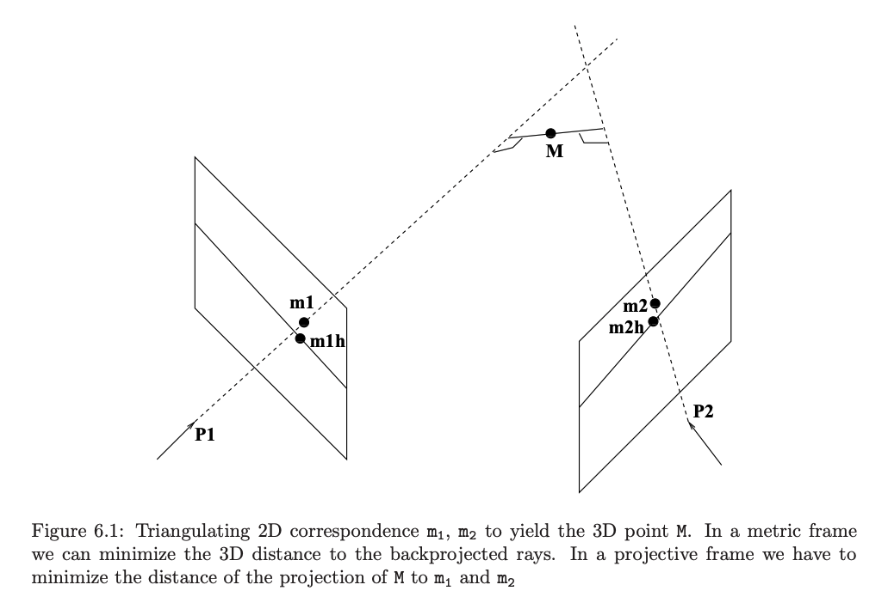
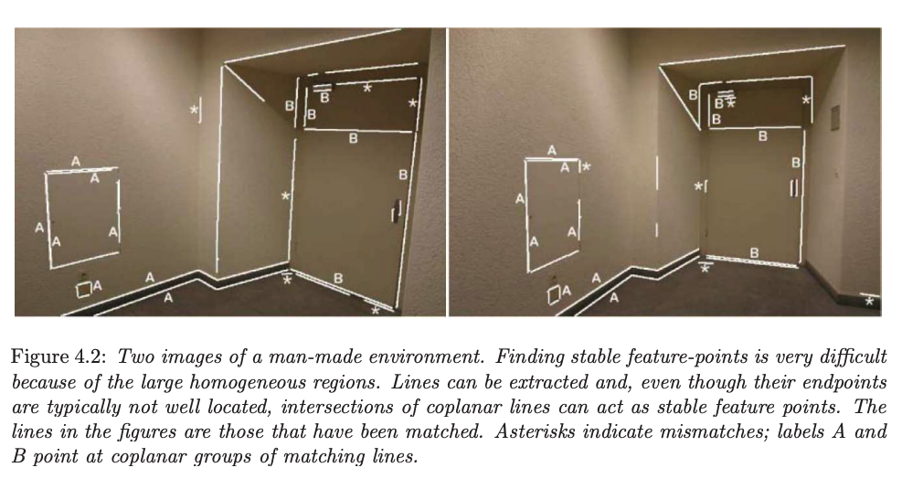
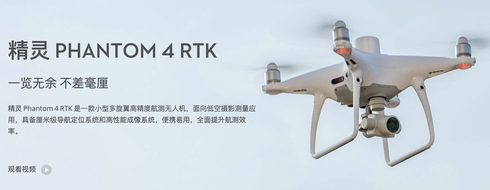

<style>
img[alt~="center"] {
  display: block;
  margin: 0 auto;
}
</style>

# 无人机三维重建与遥感迁移学习

#### 在河南特大洪涝灾害中的应用探索

关键词：减灾科技、点云、迁移学习

2021.10.20 司马数慧

汇报人：金泊翰 （手机号）

指导与协助：苏锦华、祁晨瑞

Available at https://github.com/SmartDataLab/DRT-SHARE

Written by Marp and Mermaid in Markdown


---

# 讲稿说明

预计讲稿4000字 
20分钟（会场时限是25分钟，留一定的富裕时间） 
语速控制在每分钟200字 
预计20-30页PPT有实际内容的PPT
请根据我的讲稿文字进行PPT的协助补充

---

```
大家上午好，我是中国人民大学环境学院的金泊翰，
研究方向是遥感与无人机，现担任人大无人机协会社长，在司马数慧公司承担数据处理工作。
非常荣幸受邀参加R会，就我们团队在无人机三维重建和遥感的迁移学习的技术方面的探索进行分享，
并介绍我们在本次河南洪水当中的初步实践


```

---

<!-- https://emojipedia.org/twitter/ just coppy -->
<!-- https://emojipedia.org/shortcodes/ -->
<!-- https://alanhou.org/wechat-emoji/ -->
<!-- _class: lead -->

# 汇报内容


- :flushed: 背景与需求
- :thinking: 现有技术与研究
    + :upside_down_face: 遥感自动定损
    + :hugs: 无人机三维重建
- :frowning: 案例与目标
- :grimacing: 图像分割结果
- :yum: 损失分析结果
- :star_struck: 遥感迁移学习方案
- :smirk_cat: 讨论

---


```
我的分享内容主要如下：
首先从救灾以及保险角度介绍无人机和遥感技术的应用潜力和需求，
其次是遥感自动定损与无人机三维重建技术的原理和效果，
随后介绍的是河南洪水这个实际案例的背景以及我们希望应用上述技术实现的具体目标,
主要结果我们分为三个板块呈现:
一是对建筑物、路网和灾害源的图像分割结果；
二是对受灾区域、面积、体积，受灾前后顺序进行损失分析；
三是结合遥感以及无人机实现灾害自动化评估的流程方案；
最后板块是对技术的展望以及行业现状的讨论。
```

---
# 背景与需求

台风、暴雨、洪水、山体滑坡等重大灾害发生后，保险公司需要第一时间了解企业、建筑及工程等受灾标的灾前和灾后情况，精确、快速的评估标的损失，以迅速开展施救和定损工作，减少客户损失，助力灾后恢复重建。


<!--  -->

<!--  -->

<!--  -->


---


```
我们先从行业背景引入这个分享的话题，
我们对系统性风险的防护其实是很不足的，
大型灾害给个体带来的风险缺乏有效的风险管理方案，
在国外，洪水险、房屋险等相关的灾害保险已经成熟，
但国内保险业在灾害保险的发展上相对滞后，
庆幸的是，中国的救灾与防控能力在世界上首屈一指，
并且如中国再保险集团、中国地震局、国家减灾中心等机构
积极应用遥感技术监控灾害风险，推出地震模型服务于保险产品
总体上监控受灾情况，自动评测受灾等级对实时救援、保险理赔有重要意义
应用遥感技术的保险技术中，农业保险发展较早，并且较为成熟,
因为农业的各项数据数据足够丰富且高频，无论是产量，
还是说卫星数据源有针对主流作物的特定谱段的图像传感器，
总而言之，言而总之，遥感对于高频监控的农业保险是有优势的，
同理国外洪水保险发展的较早，洪水台风作为一种高频的自然灾害，
也客观使得洪水保险模型收敛所需的数据较少，
所以国外是已经涌现了一批与灾害保险相关的所谓的保险科技公司，
比如应用遥感技术对房屋进行全自动的承保、定损、理赔、续保流程，
但反观国内，房屋险虽然是有，但不承保川蜀等地震高发区，
洪涝损失虽然是保，但保司会要求个人向气象局申请重大气象灾害证明，
而气象局通常不对个人出示证明，所以很多时候对于灾害理赔的道路是坎坷的，
对于保司来说，管控定损的成本以及保证资产安全的精算定价都是信息匮乏且压力巨大的。
遥感与无人机技术听起来有潜力在监控和定损上提供更多信息，它是不是出路不好说，但是现有房屋险产品的改进是市场需要的。
因为目前的房屋险其实主要保障的就是火灾、失窃等人为因素造成的损失，无法真正保障灾害造成的损失。
```


---
# 现有技术与研究

##### 遥感自动定损

确定是只有房屋信息 而且其实高程信息难以获得，一般只能获得屋顶损毁和重度损坏。优点是序列数据，全球观测，可以持续观测灾害主体，比如山火、洪水。
##### 无人机三维重建

无人机遥感等观测技术和人工智能的长足发展，为快速精准评估企业、建筑及工程损坏情况、滑坡塌方土方量等提供了可能。
优点是更精细、专注小区域，可以得到斜拍信息。


---

```
那么遥感和无人机技术究竟怎样应用在监控与自动定损，以及两者的适用条件和优缺点在何处，
我们先来了解一下技术的原理和当前技术的上边界在哪里。
```

---

# 自动定损技术


---


```
遥感自动定损技术技术使用灾后影像作为输入，在数据允许的条件下，使用灾前遥感图像作为辅助，
识别建筑物区域以及不同建筑物的物理受损等级，只用灾后图像通常难度会比较大，
对于灾损严重的区域，甚至无法识别出正确的建筑物面积。
上图可以说明正常卫星影像下建筑物区域的识别已经是成熟任务，
IoU可以达到90%以上，基本对于巨型灾害的识别可以形成产品优化相关行业流程。
```


---

# 自动定损技术 cont.


---

```
同时使用灾前灾后图像可以认为是变化检测问题，
这样做的好处是，灾前建筑物轮廓清晰，使得建筑物区域可以被有效分割。
同时灾前灾后的图像通过对比可以更准确的判定单次灾害造成的变化，
防范既有损失的房屋骗保，减少逆向选择的问题。
其中具体的模型和原理我们简要介绍一下，但不是本次分享的重点
（xView2 使用的CNN模型）
对于建设物损毁的识别，我们使用CNN-based的模型来提取遥感影像的主要特征，因为灾前灾后影像的对应关系,
我们使用了孪生网络模型结构，即使用同一个编码器来对灾前灾后的图像进行编码,这样保证两张图像经过相同的变化后，
在隐藏层中进行相减等操作也仍然是合理的，将两个图像经过相减可以认为是一次人工的特征工程操作，
对相减的结果进行解码，直观上更加符合变化检测这个任务本身，实验也证明这样的方式使得模型能更加准确地判断损毁等级,
经过解码层后通过全连接层和softmax方法得到5层输出，语义分割结果就是选出每个像素点预测结果中概率最大的那个类别,
其中空洞卷积以及金字塔池化两个模型结构组件对分类效果的提升也有明显帮助。
将建筑物分为轻度损毁到重度损­毁5个类别,五分类F1分数可以达到80%,说明现有技术已经初见雏形,有应用潜力;
但受制于现有数据集标签精细程度,更精细的损毁等级判定效果如何有待探索,对于自动定损，自然希望损毁识别的更精细;
对于应用与定损赔付，需要与房产评估、房价地图等数据进行联合分析;
```

---

# 卫星遥感-->无人机

原因:结合卫星遥感影像以及无人机点云得到更好灾害损坏评估。

| 维度 | 卫星遥感 | 大疆无人机 |
| :-: |  :-: |  :-: |
| 采集延时 | 通常15天以上复经  | 飞手前往目标地点 |
| 采集范围 | 通常10^3到10^4km^2 | 飞行限高500m |
| 采集质量 | 分辨率米级 | 4K相机 |
| 采集成本  | 限制交易 | 通常设备成本5w以内 |
| 历史数据 | 有 | 无 |
---

```
但遥感影像最大的问题在于更新频率有限制，一般卫星需要15天左右才会途径相同区域进行拍摄，
对于实时救援来说，尤其是救援分秒必争的地震、山火、泥石流等巨型灾害，灾害发生越快越自动化的评测是最有必要的，
对于洪水、台风等持续性但灾后相对容易恢复的季节性自然灾害，需要短期集中的持续性的观测，
另一方面，遥感影像分辨率受限，因为国家安全以及技术原因，亚米级分辨率遥感数据难以获取，
同时拍摄角度为垂直拍摄，对于阴影有限的小型建筑物的高程信息估计不是很准确，
更不要说获取实时救援中最希望获取到受困群众的信息了，这时候无人机的优势恰好能弥补上述缺点，
这两个技术有诸多共同点和差一点，这是两者的相似点和差异点,
目标是结合两者扬长避短，得到更好的灾害损坏评估
```
---
### 无人机三维重建技术

      


---

```
无人机数据对于房屋定损更有价值的核心原因是房屋的三维重建技术,三维重建的难度在不同数据源上是不同的，
数据源从单次拍摄的角度来说分为双目相机和单目相机，从传感器上分为RGBD相机和RGB相机
（雷达可以认为是一种纯D的传感器，但成本很高），根据拍照的频率，分为稠密和非稠密，从技术的难度上看，
单目RGB相机非稠密拍摄是最难的，但也算最节省成本的，所以研究的热度也越来越高，
这种低成本的有一个名称叫Image-based Modeling
当然也有可能元宇宙越来越火，毕竟三维重建可以低成本构建游戏场景，
言归正传，其实人眼是双目相机，而无人机以大疆为例通过指定飞行轨道和拍摄方案，
使得相近照片可以通过匹配相同像素点来估计像素点的空间位置，当从多角度都有拍摄。
实际操作下照片是连续的，而且地理位置相邻的两张照片重叠部分超过70%。
通过灰度图以及图像梯度来识别图案中的重要像素点或者线条，
无人机三维重构是否成功通常也取决与这些重要像素点或者线条是否处于刚体
对于刚体来说，多张照片上更容易匹配上述的参考点和参考线
```


---

**相机模型**

  

---

**点云与测绘行业**

- 高精度GPS系统（绝对位置）
- 惯性导航系统（相对位置）
    - 传感器：加速度计、陀螺仪
    - 算法：卡尔曼滤波




---

```
无人机根据指定轨迹进行拍摄，比如Z型的扫描，使得多次拍摄的照片能够拼接成一张大图。
无人机三维重构就是根据相机模型来计算参考点和参考线的相对位置，因为同一个建筑物在无人机的多次拍摄下存在角度差异，
这样的差异通过匹配可以刻画建筑物的高度以及三维信息，
这个刻画的过程会生成一种数据叫点云，如图所示，
点云源于多次拍摄中匹配的像素点，这些像素点结合无人机的GPS定位能够确定绝对的空间位置信息，
所以通过进一步处理能够得到三维模型，高程信息、材质信息都可以通过点云得到很好的描述，
这一技术已被广泛应用在测绘领域，对房屋的估价也有很大的帮助
房屋测绘结果对于房产评估来说是重要的支撑数据，
当然最重要的是房价数据，单位房价主要通过二手房信息以及租赁信息数据利用经济学公司进行反推的,
对于房产评估行业来说，有天然的动力去压低房屋测绘成本，无人机测绘也自然发展迅速，相对成熟。
大疆精灵系列也优化了GPS模组和惯导模组，推出了RTK系列，比精灵4贵一倍，
但经我们测试，RTK定位以及后续点云处理还出现了问题，所以对于房屋定损
RTK最大的好处是能倾斜拍摄，但是因为精灵4Pro支持SDK开发，
使用SDK也可以达到倾斜拍摄的目的，所以目前RTK还是略显智商税
```

<!-- https://www.sohu.com/a/347889620_100237201 -->

<!-- https://zhuanlan.zhihu.com/p/54570516 -->


---

# 实际案例:河南洪水

<!-- _class: lead -->

> **中新网7月28日电:** 国家防汛抗旱总指挥部秘书长、应急管理部副部长兼水利部副部长周学文指出，7月16日以来，河南省洪涝灾害已造成郑州、新乡等16个市、150个县市区、1366.43万人受灾，有73人遇难。


---
 
```
今年7月中旬至8月初,受台风影响,河南发生罕见特大洪涝灾害，
河南周边城市降水变化也同样明显,其中地铁受淹致使乘客丧生的新闻令人痛惜，
关于灾情的监控与通信是一个养兵千日用兵一时的工作
面对巨大的自然灾害，个体就好比沧海一粟那样渺小
ss
```

---

# 灾后无人机影像

8月1日-3日，人大无人机社两名飞手前往河南鹤壁，设备是大疆Pro和RTX。


> 武汉长江救援志愿队于22日在有关方面的安排下，转赴灾情严重的鹤壁。


---

```
出于对灾情的关注，人大无人机社在人大统院白琰冰老师和司马数慧的支持下，
在遵守疫情防控条件、不影响灾区救援工作以及保护自己安全的前提下，
在灾情缓解的8月1日至8月2日前往了河南鹤壁，
使用大疆精灵4 pro以及rtx两架无人机采集了相关灾后影像。
```


---

# 灾后无人机影像cont.

- 拍摄角度
    + 垂直拍摄
    + 倾斜拍摄
- 飞行轨迹
    + Z型扫描
    + 五向飞行


---

```
无人机采用Z型扫描并保证
```

---
# 遥感数据（灾前）
- Google Earth
    - 2017年5月
    - 2018年2月
    - 2019年12月
    - 2021年1月

<!--  -->


---

# 无人机数据（灾后）

  


---

```
根据了解，我们前往了鹤壁靠近水源的多家村庄，
如秦李庄村等，据村民描述，洪水最严重时道路水深可以淹至腰部。
我们到达时鹤壁洪水已经散去，村中有一间旧房受淹后坍塌，
有比较明显洪水痕迹的区域主要是水源附近植被,农田以及泥沙较多的建筑工地等。左下的图有一间土房坍塌，所幸没有人员伤亡。
```

---
# 数据处理


<!--   -->


  


---

# 具体目标


【语义分割】利用深度卷机网络实现对现场房屋、道路等的实时识别。

【三维重构与灾情分析】基于无人机、遥感卫星的多源多模态大数据和深度迁移学习技术，实现对灾情现场的快速3D重建，实现灾前灾后对应位置的标注和对比，实现受损标的长度、面积、土方体积等的快速测量和评估。

【遥感迁移学习】传统深度学习人工智能模型依赖大量标注数据，但实际灾情多样复杂，标注数据稀缺，需要研究建立面向灾前（遥感）灾后（遥感、无人机）图像的自适应迁移学习算法，以真正将无人机遥感影像、地理信息和人工智能技术有效融合。

---


**1.语义分割**


- :smile: 建筑物分割
- :smile: 路网分割
- :smile: 水域分割


---


**2.三维重建与灾情模拟与推演**


- :smile: 淹没面积
- :smile: 淹没先后(模拟实验)
    - 水动力模型原理:比较复杂的物理引擎
    - 我们选择Flood Fill对多个水淹截面进行模拟
- :cry: 实际浸没体积
    - 对每一次的Flood Fill我们可以估算实际浸没的体积，同时内部包含的建筑物

---


**3.深度学习模型的自适应迁移**

- :cry: 自动化伪标签
- :cry: 分辨率色差迁移学习
- :cry: 材质预测


---

# 1.1 语义分割-建筑物语义分割


---

# 1.2 语义分割-路网语义分割


---

# 1.3 语义分割-水域分割(危险灾源)


---

# 2.1 淹没面积


---


# 2.2 淹没推演(模拟实验)


---


# 2.3 实际浸没面积


---
# 3.1 自动化伪标签

为什么叫伪标签，为什么不需要很准，其实成本考虑


---


# 3.2 分辨率色差迁移学习


---

# 3.3 材质预测


---

# 讨论


---

# 致谢

- 白琰冰老师
- 司马数慧
- 人大无人机协会

---

```

本研究所使用的数据由无人机协会飞手采集，司马数慧公司提供了很多设备与技术上的支持，
分享涉及的部分技术和成果受司马数慧的苏锦华和祁晨瑞师兄指导，在此一并表示感谢。
欢迎对无人机数据感兴趣的朋友们联系我们，在无人机影像采集和处理等方面开展合作。
同时也欢迎参会的人大学生加入人大无人机社团和司马数慧保险科技创新工坊。

```
